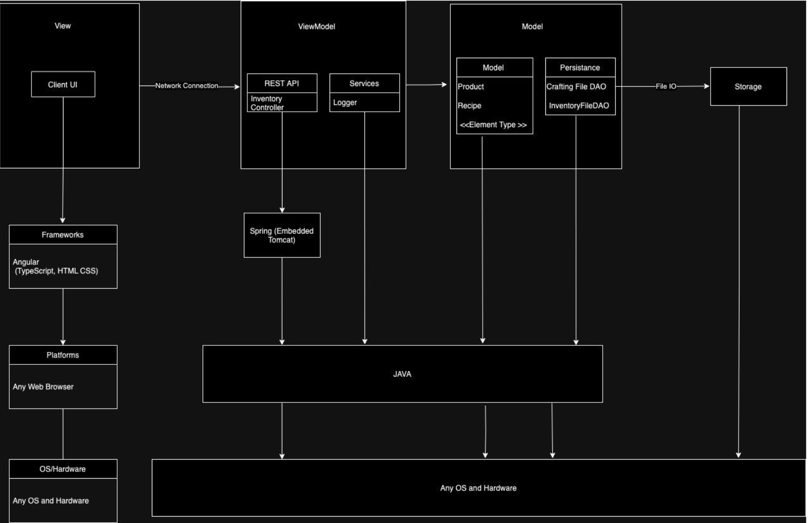
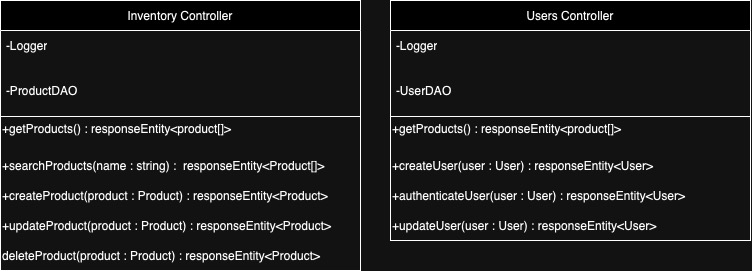

# PROJECT Design Documentation

## Team Information

- Team name: Wizards
- Team members
  - Jack Barter
  - Evan Savage
  - Joseph Skinner
  - Garrett Tupper
  - Shawn Broderick

## Executive Summary

This project is an Angular-based E-Store with a special crafting feature. Users can log in in and out of the store to see a catalog of spells. Each spell can be added to the cart where they can be purchased by the user. As a user purchases spells, more spells will become unlocked to be purchased by the user. Admins may also be able to login to the site to add, remove, or edit spells in the store. The store uses REST API for its backend communication with a file-based storage system.

### Purpose

The purpose of this project is to become familiar with the Agile software development process of a product as well as become familiar with backend REST development and front-end Angular Development

### Glossary and Acronyms

| Term        | Definition                                                        |
| ----------- | ----------------------------------------------------------------- |
| SPA         | Single Page Application |
| Crafting    | Process of how users unlock new products |
| DAO         | Data Access Object |
| Service     | Implements data / Business Logic not directly related to the view |
| Routing     | Angular component for changing the view of the page |
| UI          | User Interface |
| API         | Application Program Interface |
| Controller  | Acts as a communication point between the model and view |
| Model       | Acts as the data structure of the application |
| Persistence | Acts as the data storage mechanism for the application |

## Requirements

This section describes the features of the application.

### Definition of MVP

There are several different categories for the Minimal Viable Product (MVP) that must be delivered. This does not include enhancements that we chose for our E-Store.

Minimal Authentication

- A user (Buyer or Owner) can log in or out to the application.
- The Owner logs in using the reserved username "admin".
- Any other username can be assumed to be a customer.

Shopping Experience

- A Buyer should be able to search for a product.
- A Buyer should be able to view the catalog in it's entirety.
- A Buyer should be able to add or remove a product from their cart.
- A Buyer should be able to view items currently in their cart.

Admin Functionality

- An Owner can add, modify, and delete products.
- An Owner should not have access to a cart.

### MVP Features

- A user (customer or e-store owner) can login or out to the application-minimal authentication
- An e-store owner logs in using the reserved username admin
- Any other username can be assumed to be a customer
- Customer should be able to see a list of products
- A customer should be able to search for a product
- A customer should be able to add or remove a product from their shopping cart
- A customer that has items in their shopping cart should be able to log out and log back in with the items retained in their shopping cart
- A customer should be able to proceed to check out their items for purchase
- An e-store owner can add, remove, and edit the product data in the inventory
- An e-store owner should not have access to a shopping cart
- All of the pages and components required for the above should have an appealing and consistent style.

### Enhancements

- Newly registered users should require a strong password, including a symbol, number, capital, and minimum 8 characters; This password should be hashed to prevent it being read from plain text.
- Assuming correct conditions, when a customer checks out with 2 items in their cart which have a recipe defined by the system, they unlock the ability to purchase a new product.

## Application Domain

This section describes the application domain.

This model demonstrates what entities exist in our
E-Store and how they interact. Based on the MVP requirements, two main types of users exist: the Owner and Buyers. There only exists one Owner (or Product Owner). On the contrary, there is no limit on the number of Buyers. Both of these types of users can log in to the site and log out of the E-Store, as shown in the Domain Model. In addition, Buyers can register new accounts with strong passwords to access the E-Store. The strong password requirement is an enhancement that keeps accounts more secure from attacks.

A Buyer has many possible interactions that are unique to them. Mainly, they can search and view the Inventory. Searching provides a mean of limiting the results shown. The Inventory itself is divided into categories containing any number of Products. Each Product has descriptive information, including its name, price, quantity, type, and image. The Inventory may divide itself into categories based on the type of each Product, or however the Buyer wishes to view the Inventory. This may include filtering and sorting by various attributes available to them, such as price or completion.

In addition, the Buyer can also add or remove products to their Shopping Cart. From the Shopping Cart, all of its contents can be paid for using one of the Payment Methods shown in the Domain Model. Our second enhancement involves the fact that Products can be crafted together to unlock and discover a new Product. Buyers can only view Products that were unlocked by default or have discovered by purchasing its combination of two Products (e.g, Water and Fire might yield Steam).

As for the Owner, they have an important role too. The Owner is mainly responsible for updating the Inventory in various ways. This may include: adding products, removing products, or editing products. Editing a Product is considered changing a piece of its data in some way so that the Buyer can see the change made in the Inventory.

## Architecture and Design

This section describes the application architecture.

The following Tiers/Layers model shows a high-level view of the webapp's architecture.

### Summary

The majority of our architecture choices are constraints defined by our product owner. However, while using these technologies and programming languages we are maintaining best practices in all aspects of the project. Our stack is built upon the Model-ViewModel-Model design. The Client UI must communicate with the ViewModel in order to receive information from the model and send information back. In terms of our architecture that means that our UI is built as its own Angular app that connects to the backend via HTTP requests that call our REST API. The REST API then makes calls to our DAO File classes to store/update/remove information such as user credentials and product information.

### Overview of User Interface

This section describes the web interface flow; this is how the user views and interacts with the web application.

> _Provide a summary of the application's user interface. Describe, from the user's perspective, the flow of the pages in the web application._

### View Tier

> _**[Sprint 4]** Provide a summary of the View Tier UI of your architecture.
> Describe the types of components in the tier and describe their
> responsibilities. This should be a narrative description, i.e. it has
> a flow or "story line" that the reader can follow._
>
> _**[Sprint 4]** You must provide at least **2 sequence diagrams** as is relevant to a particular aspects
> of the design that you are describing. (**For example**, in a shopping experience application you might create a
> sequence diagram of a customer searching for an item and adding to their cart.)
> As these can span multiple tiers, be sure to include an relevant HTTP requests from the client-side to the server-side
> to help illustrate the end-to-end flow._
>
> _**[Sprint 4]** To adequately show your system, you will need to present the **class diagrams** where relevant in your design. Some additional tips:_
>
> - _Class diagrams only apply to the **ViewModel** and **Model** Tier_
> - _A single class diagram of the entire system will not be effective. You may start with one, but will be need to break it down into smaller sections to account for requirements of each of the Tier static models below._
> - _Correct labeling of relationships with proper notation for the relationship type, multiplicities, and navigation information will be important._
> - _Include other details such as attributes and method signatures that you think are needed to support the level of detail in your discussion._

### ViewModel Tier

The classes that support the ViewModel tier are as follows:

- Inventory Controller
- Users Controller

> _**[Sprint 4]** Provide a summary of this tier of your architecture. This
> section will follow the same instructions that are given for the View
> Tier above._

The inventory controller is responsible for keeping track of any changes made to our catalog of spells. The owner of the site can take use of these functions to maintain the list of products displayed on the site. The users controller is responsible for maintaining the list of all users that have registered to the site. It also provides functionality
to authenticate a user, making sure that all usernames registered to the site are unique.

### Model Tier

The classes that suport the Model Tier are as follows:

- Product
- Element
- Recipe
- User

A product is a representation of a spell, therefore, it has an elemental type. This comes from our element enumeration to ensure that the types are consistant throughout.
A recipe is a combination of exactly two spells that form to create a new spell - this takes in the spells ID's and outputs a new ID. A user is a buyer on the site and has both a username and password that they create upon registering and need to use to login. They also have a cart which is a represenation of the products that they plan on purchasing.
As part of our 10% feature they have an array of unlocked spells which starts out at 4 basic spells and expands as the user unlocks more by purhcasing two spells that are valid inputs in a recipe to make a new spell. A buyer of the site can only view spells that have unlocked.

> _**[Sprint 2, 3 & 4]** Provide a summary of this tier of your architecture. This
> section will follow the same instructions that are given for the View
> Tier above._

## OO Design Principles

> _**[Sprint 3 & 4]** OO Design Principles should span across **all tiers.**_

### 1. Single Responsibility

With the structure of our project it is incredibly important to be strongly adhering to the principle of Single Responsibility. One subsystem of the backend that displays this clearly is in the product and related classes:

- Product - Holds the state of each project, only has mutators and getters.
- ProductFileDAO - Holds all the methods for interacting with, and creating, an array of products, but has no state.
- InventoryController - A wrapper to allow the ProductFileDAO to interact with HTTP, holds no unnecessary state.

We will continue with this principle, keeping our code split into single responsibility classes and components as our REST API and front end expand.

### 2. Open/Closed

After reviewing our project, we noticed that, because of the nature of our e-store, we don’t have many interfaces or abstract classes in our design. This could be something that we could improve upon, but if our project doesn’t ask for it, then why do it. Now that isn’t to say that there's no occurrences of open/closed in our project as our `ProductDAO` and `CraftingDAO` are both great examples. They’re interfaces that we used to implement the data from the files stored in the ./data directory of our repo. `ProductDAO` is used for our products (spells), and `CraftingDAO` is used for our cart (crafter). These files are both implementable and unmodifiable because they’re interfaces. The classes that use them, `ProductFileDAO` and `CraftingFileDAO` are unmodifiable as well as they only provide information on our products and recipes respectively for the rest of our api. As we only have one type of product, a spell, there really isn’t any other place to incorporate interfaces and abstract classes. Our crafting isn’t really a help either because it only deals with recipes as that can be handled with one class. If we were to add more product types like tools, we could create a `Product`, `Spell`, and `Tool` class where `Spell` and `Tool` would extend `Product`. Something like this is an improvement we could do to our api to not repeat ourselves and incorporate the Open/Closed principle.

### 3. Low Coupling

Our current project structure is in a great place with coupling. All of our codebase follows this principle, but the best example is the Product subsystem:

- Product - Product is only directly referenced in the ProductFileDao
- ProductFileDAO - Directly references the Product class, is referenced by the Inventory Controller
- InventoryController - Directly references ProductFileDAO, only references Product as far as taking input for create and update.

With this current setup we form a chain of couples, reducing the work required in the event of refactoring any of the given classes. We’re going to continue using this principle as we expand our backend api and frontend application.

### 4. Information Expert

The principle of information expert will be used within our design by making sure classes are
responsible for doing calculations and editing their own attributes. One example of this would be
our toString method within our Product class. Having the string be created by a method within
Product instead of ussing getters outside of the Product class keeps the product utilizing it's own
attributes improving readability and reducing unneeded complexity.

### 5. Law of Demeter

The law of demeter is the object oriented programming principle that dictates the ability
of one class to access another. Specifically, this principle states that classes should avoid interacting with and controlling the state of other classes directly unless they are dependent on each other. In terms of our REST API design this method manifests itself in the separation of responsibilities between the product controller class, the DAO class and the object mapper. It would be possible to combine all of these features into one large class where the controller class instead has the attributes of the DAO and interacts with the object mapper directly to store and retrieve products in the form of JSON objects in a file as well as make HTTP requests. However, this would be a very complex and cumbersome class to write as the nature of these features warrant the creation of separate classes to handle each of them. In maintaining the Law of Demeter in our design the product controller class can only access the product file DAO by having a product file DAO attribute. As a result the product controller class can only make calls to the product DAO which in turn makes calls to an object mapper. This process allows for each class to focus on one and only one feature - allocating more specific tasks to other classes keeping a clean chain of calls to different classes when needed. We will continue to adhere to this practice as we progress through the project by ensuring proper separation between tasks and classes properly encapsulate their data.

### 6. Dependency Injection

Dependency Injection is the object oriented programming principle that dictates that objects should be instantiated independently from any classes they may be used in. Maintaining this design principle ensures loose coupling across the program since some objects will not have to wait for others that they are not related to to be instantiated in order to function properly. In terms of our REST API design this idea can be seen in the use of the @component tag. Upon running the program any class that is decorated with this tag is instantiated and injected into any other class that uses this class. This ensures that classes that depend on other objects that are components need not worry about instantiating new objects of the classes they need as that will all be done by REST. We will continue to adhere to this practice as we progress through this project by properly using the @component tag on component elements in the project.

### 7. Controller

In our project's E-Store, the concept of a Controller is implemented in many different ways. However, most obviously, explicit controller classes exist in our backend’s architecture. Specifically, controllers handle incoming HTTP requests in our Spring/Tomcat environment. They relay operations made on the frontend and update a saved version of the model on the backend. In our case, the controller classes directly interface with the persistence layer to store any changes to the model on disk. Each controller in our design is responsible for CRUD operations surrounding one part of the model (e.g., a Product). Importantly, this allows the front-end to be separated from any logic required to query/change data (e.g., renaming a product). In a sense, it exists as a means to control how requests to the backend affect the E-Store, whether it requires sanitizing input, responding with error codes, and so on. See below for an example:

### 8. Pure Fabrication

Another vial concept that we use in our design of the E-Store is Pure Fabrication. Pure Fabrication classes assist in maintaining the single responsibility of other classes in the program. Typically, they are not actors in our Domain Analysis and have a more technical responsibility, like saving data. In our E-Store, this would be how our persistence is implemented in our API. Instead of having each Product class responsible for saving its data (either by dependency injection in the Product or not), there exists data access objects (DAO) that are responsible for loading/saving pieces of the model, like a Product. This allows model classes themselves, like the Product class, to remain well-designed and are only responsible for storing datain its fields. For example, our projcet currently implements a ProductDAO interface named ProductFileDAO that stores product data to disk using JavaScript Object Notation(JSON). Even though Pure Fabrication adds a dependency between ProductDAO and Product, it helps adhere to other important design principles like single responsibility and low coupling. See below for an example:

## Static Code Analysis/Future Design Improvements

> _**[Sprint 4]** With the results from the Static Code Analysis exercise,
> **Identify 3-4** areas within your code that have been flagged by the Static Code
> Analysis Tool (SonarQube) and provide your analysis and recommendations.
> Include any relevant screenshot(s) with each area._
>
> _**[Sprint 4]** Discuss **future** refactoring and other design improvements your team would explore if the team had additional time._

### Static Code Analysis

#### Unused Imports

We have a couple issues, brought up by sonarqube, reguarding unused imports. This isn't a crazy challenge to fix as it's just removing one line per unused import. In the future we should've set outselves a soft deadline as to insure we have enough time to clean up these small mistakes.

#### Irrelivent Public Modifier on Test Methods

There are _a lot_ of errors complaining about a public modifier on test methods as I believe we have a public modifier on every test method. Apparently in JUnit 5, you don't need to have a public modifier for tests compared to in JUnit 4. This is another one of those small mistakes that we should've accounted for and set aside time to fix all of them nearing the end of Sprint 3.

#### Inconsistant Use of Built-In Formatting for Strings

### Future Design Improvements

Somethings that we could've improved on, if we had more time, includes:

- Fixing all the little SonarQube issues
- Replacing `sortByID` with `sortByDateUnlocked`
  - As it would be a quality of life improvement to the user over sorting by a product's ID.
- More tests
  - To increase code coverage
- Saving the user's credit card data
  - So they wouldn't have to input it every time

There are multiple cases, mainly with logs, that SonarQube tells us that we could've used the built-in formatter. One of the problems this introduces is a hit to performance as everytime the method is ran, it will process the concatination.

## Testing

### Acceptance Testing

As of Sprint 2, all acceptance criteria are passing. There were no complications verifying each, as every team member was able to pass their assigned acceptance criteria for testing without any concerns. We managed to run through our Acceptance Plan Test within the span of a day once the final merge request in the sprint was approved.

### Unit Testing and Code Coverage

#### Unit Testing

#### Strategy

Our strategy when writing tests was to write tests confirming functionality as a part of the solution tasks for a given story. This meant that the same person writing the tests was writing the code, which we doubt is ideal. We likely would have had a better, and easier time adhering to a strategy such as pair or ping-pong programming. It also meant that we did not have a final pass to correct or update unit tests for old methods, that were not added by sprint 3 stories.

#### Code Coverage

We targetted 90% as our requirement for code coverage, mostly informed by the rubric for the project marking 90% as the metric for full credit. We didn't target any higher, because while coverage is a useful metric for tests, it is not the full picture, and targeting 100% would likely have ended up with us writing poor quality tests that, although covering every line, would not be terribly valuable.

Currently, we are meeting the 90% coverage requirement. The largest tier contributing to low code coverage seems to be the Persistence Tier, which is explained below.

Based on the report, CraftingFileDAO is not being tested enough. This file was implemented without sufficient tests, and it's coverage was not viewed frequently enough for this to be caught, more focus on testing during sprint 3, rather than almost entirely focusing on the front end, would likely have prevented this file from becoming an issue.

Model tier is well covered, as most of it was completed in sprint 2, but our lack of focus on testing in sprint 3 has really hurt the coverage of the recipe class, which, as part of 10% enhancement, was added in sprint 3. Regardless, because the recipe is a small part of the code base, our overall coverage for the tier is still solid.

Our controller tier is excellently tested, but as noted in our sprint 2 design doc, one method `InventoryController.getProducts()` is entirely untested, and we never revisited existing methods for unit testing, definitely needed to put more focus on testing in our sprint 3 planning.

## Ongoing Rationale

### (2024/02/08): Sprint 1

We decided on a homogenous style to our codebase to ensure the readibility and understandability of our code.
These decisions include:

- Javadocs for fields aren't necessary
- Include a Javadoc for each method
- Create tab align for Javadoc Params. Exmaple -> 
- Write out `return this.var` rather than `return var`
- 4 Tab width with tabs rather than spaces

### (2024/02/22): Sprint 2

We discussed the basic layout for the site as well as how our website would be structured internally.
This included things like:

- What our navbar would contain
  - Catalog
  - Admin (If applicable)
  - Cart
  - Logout Button
- How our navbar items would aligned
- That our login page should be the root-page
- The urls for each of the pages
  - Catalog: `/catalog`
  - Admin: `/admin`
  - Cart: `/cart`
  - Login: `/login`
  - Register: `/register`
- What our login page would look like

We decided to make the login page our root page because of one of our enhancements: the crafting system. This would make it so that the user would only be able to see the items that they had unlocked and would have to craft new items to see them in the catalog. Unlike a normal e-store, we wouldn't be able to make our root page our catalog as it now requires an account to function. This makes chosing to make the login page the root page an easy decision as it's kind of the gateway for the site to function.

All of our brainstorming can be seen below on the whiteboard.

### (2024/03/24): Sprint 3

We discussed a consistent look and color scheming for the styling of the site. Our team utilized [Realtime Colors](https://www.realtimecolors.com) to propose different styling options for our site and decided on a final set of colors and fonts.
Decisions Included

Color:

- Background: #230b2a
- Text: #FFFFFF
- Primary: #791BAF
- Secondary: #B888DD
- Accent: #F0BF0F

Fonts:

- Headings: Vollkorn SC
- Paragraphs: Underdog

We also decided on the admin page being displayed and edited as a spread-sheet like setup.
