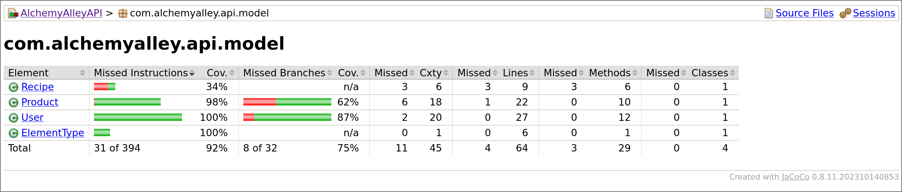

---`
geometry: margin=1in
---
# PROJECT Design Documentation

> _The following template provides the headings for your Design
> Documentation.  As you edit each section make sure you remove these
> commentary 'blockquotes'; the lines that start with a > character
> and appear in the generated PDF in italics but do so only **after** all team members agree that the requirements for that section and current Sprint have been met. **Do not** delete future Sprint expectations._

## Team Information
* Team name: Wizards
* Team members
  * Jack Barter
  * Evan Savage
  * Joseph Skinner
  * Garrett Tupper
  * Shawn Broderick

## Executive Summary

This project is an Angular-based E-Store with a special crafting feature. Users can log in in and out of the store to see a catalog of spells. Each spell can be added to the cart where they can be purchased by the user. As a user purchases spells, more spells will become unlocked to be purchased by the user. Admins may also be able to login to the site to add, remove, or edit spells in the store. The store uses REST API for its backend communication with a file-based storage system. 

### Purpose
>  _**[Sprint 2 & 4]** Provide a very brief statement about the project and the most
> important user group and user goals._

### Glossary and Acronyms
> _**[Sprint 2 & 4]** Provide a table of terms and acronyms._

| Term | Definition |
|------|------------|
| SPA | Single Page |

## Requirements

This section describes the features of the application.

### Definition of MVP

#### Sprint 2
For Sprint 2, our MVP was poorly defined, as the provided MVP requirements are for the U-fund project. Therefore we had to adapt these requirements for our webstore.

Minimal Authentication
- A user (Buyer or Owner) can log in or out to the application.
- The Owner logs in using the reserved username "admin".
- Any other username can be assumed to be a customer.

Shopping Experience
- A Buyer should be able to search for a product.
- A Buyer should be able to view the catalog in it's entirety.
- A Buyer should be able to add or remove a product from their cart.
- A Buyer should be able to view items currently in their cart.

Admin Functionality
- An Owner can add, modify, and delete products.
- An Owner should not have access to a cart.

#### Sprint 4
> TBD

### MVP Features
>  _**[Sprint 4]** Provide a list of top-level Epics and/or Stories of the MVP._

### Enhancements
> _**[Sprint 4]** Describe what enhancements you have implemented for the project._

## Application Domain

This section describes the application domain.

This model demonstrates what entities exist in our
E-Store and how they interact. Based on the MVP requirements, two main types of users exist: the Owner and Buyers. There only exists one Owner (or Product Owner). On the contrary, there is no limit on the number of Buyers. Both of these types of users can log in to the site and log out of the E-Store, as shown in the Domain Model.

A Buyer has many possible interactions that are unique to them. Mainly, they can search and view the Inventory. Searching provides a mean of limiting the results shown. The Inventory itself is divided into categories containing any number of Products. Each Product has descriptive information, including its name, price, quantity, and type. The Inventory may divide itself into categories based on the type of each Product, or however the Buyer wishes to view the Inventory.

In addition, the Buyer can also add or remove products to their Shopping Cart. From the Shopping Cart, all of its contents can be paid for using one of the Payment Methods shown in the Domain Model.

As for the Owner, they have an important role too. The Owner is mainly responsible for updating the Inventory in various ways. This may include: adding products, removing products, or editing products. Editing a Product is considered changing a piece of its data in some way so that the Buyer can see the change made in the Inventory.

## Architecture and Design

This section describes the application architecture.

### Summary

The following Tiers/Layers model shows a high-level view of the webapp's architecture.
**NOTE**: detailed diagrams are required in later sections of this document.
> _**[Sprint 1]** (Augment this diagram with your **own** rendition and representations of sample system classes, placing them into the appropriate M/V/VM (orange rectangle) tier section. Focus on what is currently required to support **Sprint 1 - Demo requirements**. Make sure to describe your design choices in the corresponding _**Tier Section**_ and also in the _**OO Design Principles**_ section below.)_

The web application, is built using the Model–View–ViewModel (MVVM) architecture pattern.

The Model stores the application data objects including any functionality to provide persistance.

The View is the client-side SPA built with Angular utilizing HTML, CSS and TypeScript. The ViewModel provides RESTful APIs to the client (View) as well as any logic required to manipulate the data objects from the Model.

Both the ViewModel and Model are built using Java and Spring Framework. Details of the components within these tiers are supplied below.

### Overview of User Interface

This section describes the web interface flow; this is how the user views and interacts with the web application.

> _Provide a summary of the application's user interface.  Describe, from the user's perspective, the flow of the pages in the web application._

### View Tier
> _**[Sprint 4]** Provide a summary of the View Tier UI of your architecture.
> Describe the types of components in the tier and describe their
> responsibilities.  This should be a narrative description, i.e. it has
> a flow or "story line" that the reader can follow._

> _**[Sprint 4]** You must  provide at least **2 sequence diagrams** as is relevant to a particular aspects
> of the design that you are describing.  (**For example**, in a shopping experience application you might create a
> sequence diagram of a customer searching for an item and adding to their cart.)
> As these can span multiple tiers, be sure to include an relevant HTTP requests from the client-side to the server-side
> to help illustrate the end-to-end flow._

> _**[Sprint 4]** To adequately show your system, you will need to present the **class diagrams** where relevant in your design. Some additional tips:_
 >* _Class diagrams only apply to the **ViewModel** and **Model** Tier_
>* _A single class diagram of the entire system will not be effective. You may start with one, but will be need to break it down into smaller sections to account for requirements of each of the Tier static models below._
 >* _Correct labeling of relationships with proper notation for the relationship type, multiplicities, and navigation information will be important._
 >* _Include other details such as attributes and method signatures that you think are needed to support the level of detail in your discussion._

### ViewModel Tier
> _**[Sprint 1]** List the classes supporting this tier and provide a description of there purpose._

> _**[Sprint 4]** Provide a summary of this tier of your architecture. This
> section will follow the same instructions that are given for the View
> Tier above._

> _At appropriate places as part of this narrative provide **one** or more updated and **properly labeled**
> static models (UML class diagrams) with some details such as critical attributes and methods._
>

### Model Tier
> _**[Sprint 1]** List the classes supporting this tier and provide a description of there purpose._

> _**[Sprint 2, 3 & 4]** Provide a summary of this tier of your architecture. This
> section will follow the same instructions that are given for the View
> Tier above._

> _At appropriate places as part of this narrative provide **one** or more updated and **properly labeled**
> static models (UML class diagrams) with some details such as critical attributes and methods._
>

## OO Design Principles

> _**[Sprint 1]** Name and describe the initial OO Principles that your team has considered in support of your design (and implementation) for this first Sprint._

> _**[Sprint 2, 3 & 4]** Will eventually address upto **4 key OO Principles** in your final design. Follow guidance in augmenting those completed in previous Sprints as indicated to you by instructor. Be sure to include any diagrams (or clearly refer to ones elsewhere in your Tier sections above) to support your claims._

> _**[Sprint 3 & 4]** OO Design Principles should span across **all tiers.**_

###### 1. Single Responsibility
With the structure of our project it is incredibly important to be strongly adhering to the principle of Single Responsibility. Even in our most basic skeleton we have our REST api split into many classes, for example:
* Product - Holds the state of each project, only has mutators and getters.
* ProductFileDAO - Holds all the methods for interacting with, and creating, an array of products, but has no state.
* InventoryController - A wrapper to allow the ProductFileDAO to interact with HTTP, holds no unnecessary state.
We will continue with this principle, keeping our code split into single responsibility classes and components as our REST API and front end expand.

###### 2. Open/Closed
After reviewing our project, we noticed that, because of the nature of our e-store, we don’t have many interfaces or abstract classes in our design. This could be something that we could improve upon, but if our project doesn’t ask for it, then why do it. Now that isn’t to say that there's no occurrences of open/closed in our project as our `ProductDAO` and `CraftingDAO` are both great examples. They’re interfaces that we used to implement the data from the files stored in the ./data directory of our repo. `ProductDAO` is used for our products (spells), and `CraftingDAO` is used for our cart (crafter). These files are both implementable and unmodifiable because they’re interfaces. The classes that use them, `ProductFileDAO` and `CraftingFileDAO` are unmodifiable as well as they only provide information on our products and recipes respectively for the rest of our api. As we only have one type of product, a spell, there really isn’t any other place to incorporate interfaces and abstract classes. Our crafting isn’t really a help either because it only deals with recipes as that can be handled with one class. If we were to add more product types like tools, we could create a `Product`, `Spell`, and `Tool` class where `Spell` and `Tool` would extend `Product`. Something like this is an improvement we could do to our api to not repeat ourselves and incorporate the Open/Closed principle.

###### 3. Low Coupling
Our current project structure is in a great place with coupling. Each class currently has only one connection, documented below.
* Product - Product is only directly referenced in the ProductFileDao
* ProductFileDAO - Directly references the Product class, is referenced by the Inventory Controller
* InventoryController - Directly references ProductFileDAO, only references Product as far as taking input for create and update.
With this current setup we form a chain of couples, reducing the work required in the event of refactoring any of the given classes. We’re going to continue using this principle as we expand our backend api and frontend application.

###### 4. Low Coupling
The principle of information expert will be used within our design by making sure classes are
responsible for doing calculations and editing their own attributes. One example of this would be
our toString method within our Product class. Having the string be created by a method within
Product instead of ussing getters outside of the Product class keeps the product utilizing it's own
attributes improving readability and reducing unneeded complexity.

###### 7. Controller
In our project's E-Store, the concept of a Controller is implemented in many different ways. However, most obviously, explicit controller classes exist in our backend’s architecture. Specifically, controllers handle incoming HTTP requests in our Spring/Tomcat environment. They relay operations made on the frontend and update a saved version of the model on the backend. In our case, the controller classes directly interface with the persistence layer to store any changes to the model on disk. Each controller in our design is responsible for CRUD operations surrounding one part of the model (e.g., a Product). Importantly, this allows the front-end to be separated from any logic required to query/change data (e.g., renaming a product). In a sense, it exists as a means to control how requests to the backend affect the E-Store, whether it requires sanitizing input, responding with error codes, and so on. See below for an example:

###### 8. Pure Fabrication
Another vial concept that we use in our design of the E-Store is Pure Fabrication. Pure Fabrication classes assist in maintaining the single responsibility of other classes in the program. Typically, they are not actors in our Domain Analysis and have a more technical responsibility, like saving data. In our E-Store, this would be how our persistence is implemented in our API. Instead of having each Product class responsible for saving its data (either by dependency injection in the Product or not), there exists data access objects (DAO) that are responsible for loading/saving pieces of the model, like a Product. This allows model classes themselves, like the Product class, to remain well-designed and are only responsible for storing datain its fields. For example, our projcet currently implements a ProductDAO interface named ProductFileDAO that stores product data to disk using JavaScript Object Notation(JSON). Even though Pure Fabrication adds a dependency between ProductDAO and Product, it helps adhere to other important design principles like single responsibility and low coupling. See below for an example:

## Static Code Analysis/Future Design Improvements
> _**[Sprint 4]** With the results from the Static Code Analysis exercise,
> **Identify 3-4** areas within your code that have been flagged by the Static Code
> Analysis Tool (SonarQube) and provide your analysis and recommendations.
> Include any relevant screenshot(s) with each area._

> _**[Sprint 4]** Discuss **future** refactoring and other design improvements your team would explore if the team had additional time._

## Testing

### Acceptance Testing
> _**[Sprint 2 & 4]** Report on the number of user stories that have passed all their
> acceptance criteria tests, the number that have some acceptance
> criteria tests failing, and the number of user stories that
> have not had any testing yet. Highlight the issues found during
> acceptance testing and if there are any concerns._

### Unit Testing and Code Coverage

#### Unit Testing
> _**[Sprint 4]** Discuss your unit testing strategy. Report on the code coverage
> achieved from unit testing of the code base. Discuss the team's
> coverage targets, why you selected those values, and how well your
> code coverage met your targets._

#### Code Coverage

Currently, we are meeting the 90% coverage requirement. The largest tier contributing to low code coverage seems to be the Persistence Tier, which is explained below.

Based on the report, CraftingFileDAO is not being tested enough. This is because it is a work-in-progress component and will be fully developed and tested in the next sprint.

Similar to the Persistence Tier, Recipe is not being tested enough in this tier because it is a part of a work-in-progress feature. This will be resolved in the next sprint with increased code coverage.

Based on the results of this report, the Controller Tier is very well tested, with the exception of `InventoryController#getProducts()`. This missed method is also resulting in an increase in missed branches within this tier. Come next sprint, this could easily be resolved by the addition of 1-2 more unit tests.

## Ongoing Rationale
>_**[Sprint 1, 2, 3 & 4]** Throughout the project, provide a time stamp **(yyyy/mm/dd): Sprint # and description** of any _**mayor**_ team decisions or design milestones/changes and corresponding justification._

### (2024/02/08): Sprint 1
We decided on a homogenous style to our codebase to ensure the readibility and understandability of our code.
These decisions include:

* Javadocs for fields aren't necessary
* Include a Javadoc for each method
* Create tab align for Javadoc Params. Exmaple -> 
* Write out `return this.var` rather than `return var`
* 4 Tab width with tabs rather than spaces

### (2024/02/22): Sprint 2
We discussed the basic layout for the site aswell as how our website would be structered internally.
This included things like:

* What our navbar would contain
  * Catalog
  * Admin (If applicable)
  * Cart
  * Logout Button
* How our navbar items would aligned
* That our login page should be the root-page
* The urls for each of the pages
  * Catalog: `/catalog`
  * Admin: `/admin`
  * Cart: `/cart`
  * Login: `/login`
  * Register: `/register`
* What our login page would look like

We decided to make the login page our root page because of one of our enhancements: the crafting system. This would make it so that the user would only be able to see the items that they had unlocked and would have to craft new items to see them in the catalog. Unlike a normal e-store, we wouldn't be able to make our root page our catalog as it now requires an account to function. This makes chosing to make the login page the root page an easy decision as it's kind of the gateway for the site to function.

All of our brainstorming can be seen below on the whiteboard.

